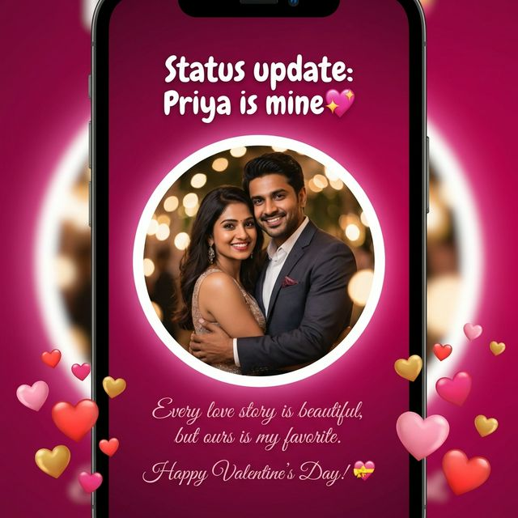

# 💖 Valentine's Day Special

A beautiful, interactive, and personalized Valentine's Day surprise application built with Next.js 15, Tailwind CSS, and Supabase. Create a unique digital experience to ask the special question!

[](https://nextjs.org/)
[](https://www.typescriptlang.org/)
[](https://tailwindcss.com/)
[](https://supabase.com/)

## ✨ Features

- **🎨 Stunning UI**: Responsive design with glassmorphism effects, floating hearts, and smooth animations.
- **💌 Personalized Experience**: Create a unique, shareable link with your partner's name.
- **⚡ Interactive "No" Button**: A playful button that evades the cursor and changes text to gently encourage a "Yes".
- **📧 Real-time Notifications**: Get notified via email instantly when your partner opens their valentine (powered by Resend).
- **🔒 Secure**: Built with security best practices including input sanitization, rate limiting, and robust security headers.
- **📱 Mobile Optimized**: Flawless experience across all devices, from phones to desktops.
- **🎆 Celebration Mode**: Confetti explosions and romantic animations upon acceptance.

## 🛠️ Tech Stack

- **Framework**: [Next.js 15 (App Router)](https://nextjs.org/)
- **Language**: [TypeScript](https://www.typescriptlang.org/)
- **Styling**: [Tailwind CSS v4](https://tailwindcss.com/)
- **Database**: [Supabase](https://supabase.com/)
- **Email Service**: [Resend](https://resend.com/)
- **Font**: [Outfit](https://fonts.google.com/specimen/Outfit)

## 🚀 Getting Started

### Prerequisites

- Node.js 18+
- npm, yarn, or pnpm
- A Supabase account
- A Resend account (for notification emails)

### Installation

1. **Clone the repository**
   ```bash
   git clone https://github.com/shivamtiwari3/valentinespecial.git
   cd valentinespecial
   ```

2. **Install dependencies**
   ```bash
   npm install
   ```

3. **Set up Environment Variables**
   Copy `.env.example` to `.env.local` and fill in your credentials:
   ```bash
   cp .env.example .env.local
   ```
   
   Update `.env.local` with your keys:
   ```env
   NEXT_PUBLIC_SUPABASE_URL=your_supabase_url
   NEXT_PUBLIC_SUPABASE_ANON_KEY=your_supabase_anon_key
   RESEND_API_KEY=your_resend_api_key
   INTERNAL_API_SECRET=your_secure_random_string
   NEXT_PUBLIC_APP_URL=http://localhost:3000
   ```

4. **Database Setup**
   Run the following SQL in your Supabase SQL Editor to create the necessary table:
   ```sql
   CREATE TABLE valentines (
     id text PRIMARY KEY,
     partner_name text NOT NULL CHECK (char_length(partner_name) <= 30),
     created_at timestamptz DEFAULT now() NOT NULL,
     view_count integer DEFAULT 0 NOT NULL,
     notification_email text,
     email_notified boolean DEFAULT false,
     couple_image text
   );

   CREATE INDEX idx_valentines_created_at ON valentines(created_at DESC);
   ```

5. **Run the development server**
   ```bash
   npm run dev
   ```

   Open [http://localhost:3000](http://localhost:3000) with your browser to see the result.

## 📸 Screenshots

| Landing Page | Experience | Success Page |
|:---:|:---:|:---:|
|  |  |  |

## 🔒 Security

This project takes security seriously. We have implemented:
- **Input Validation**: Strict validation for all user inputs.
- **Rate Limiting**: API protection against abuse.
- **Security Headers**: HSTS, X-Frame-Options, CSP, and more.
- **Sanitization**: Prevention against XSS attacks.

For more details, please refer to [SECURITY.md](SECURITY.md).

## 🤝 Contributing

Contributions are welcome! Please feel free to submit a Pull Request.

1. Fork the project
2. Create your feature branch (`git checkout -b feature/AmazingFeature`)
3. Commit your changes (`git commit -m 'Add some AmazingFeature'`)
4. Push to the branch (`git push origin feature/AmazingFeature`)
5. Open a Pull Request

## 📄 License

This project is licensed under the MIT License.

## 💖 Acknowledgments

- Made with love by [Shivam Tiwari](https://github.com/shivamtiwari3).
- Inspired by romantic gestures everywhere.
